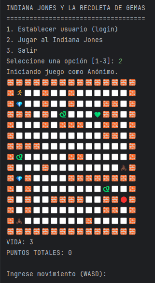

# Indiana Jones y la Recolecta de Gemas

## Descripción
**Indiana Jones y la Recolecta de Gemas** es un juego de consola desarrollado en Java donde el jugador controla a Indiana Jones a través de un desafiante laberinto.  
El objetivo principal es recolectar gemas y rubíes mientras se evitan peligros como serpientes y escorpiones.  
Con 3 vidas iniciales, el jugador debe sobrevivir y acumular la mayor cantidad de puntos posible.

El juego incluye un menú interactivo con tres opciones principales:
1. **Establecer Usuario (Login):** Inicia sesión con un nombre de usuario y contraseña.
2. **Jugar al Indiana Jones:** Comienza una partida con un usuario registrado o como "Anónimo".
3. **Salir:** Cierra la aplicación.

## Características del Juego
- **Sistema de Login:** Permite iniciar sesión con credenciales o jugar sin necesidad de registrarse.
- **Laberinto Aleatorio:** El mapa se genera con distribuciones aleatorias de:
  - **Gemas:** Cada una otorga 1 punto.
  - **Rubíes:** Cada uno otorga 2 puntos.
  - **Enemigos:**
    - Serpientes: Hacen 1 punto de daño al jugador.
    - Escorpiones: Hacen 2 puntos de daño al jugador.
  - **Vidas Extras:** Se generan aleatoriamente y desaparecen después de 10 movimientos si no son recolectadas.
- **Puntuación:** El jugador acumula puntos al recolectar gemas y rubíes.
- **Vidas:** El jugador comienza con 3 vidas. Si se queda sin vidas, el juego termina.
- **Controles:** Usa las teclas `W`, `A`, `S`, `D` para moverte por el laberinto.

## Reglas del Juego
1. Cada movimiento consume un turno.
2. Las vidas extras desaparecen si no se recolectan en 10 movimientos.
3. Si te encuentras con:
   - Una serpiente: Pierdes 1 vida.
   - Un escorpión: Pierdes 2 vidas.
4. Recolecta gemas y rubíes para sumar puntos:
   - Gema: +1 punto.
   - Rubí: +2 puntos.
5. El juego termina cuando:
   - Te quedas sin vidas.
   - Decides salir al menú principal.

## Instrucciones
1. **Inicio de sesión:**
   - Selecciona la opción 1 en el menú principal para registrar un usuario y contraseña.
   - Si no deseas registrarte, puedes jugar como "Anónimo".
2. **Comenzar partida:**
   - Selecciona la opción 2 para iniciar el juego.
   - Explora el laberinto utilizando las teclas `W` (arriba), `A` (izquierda), `S` (abajo) y `D` (derecha).
   - Evita enemigos y recolecta tantos puntos como puedas.
3. **Salir del juego:**
   - Selecciona la opción 3 en el menú principal para cerrar la aplicación.

## Requisitos
- **Sistema Operativo:** Windows, Linux o MacOS.
- **Java Development Kit (JDK):** Asegúrate de tener instalado JDK 8 o superior para compilar y ejecutar el programa.

## Ejecución
1. Clona este repositorio o descarga los archivos del proyecto.
2. Abre una terminal y navega al directorio donde se encuentra el archivo principal del juego.
3. Compila el programa con el siguiente comando:
   ```bash
   javac IndianaJones.java
   ```
4. Ejecuta el juego con:
    ```bash
    java IndianaJones
    ```
## Captura de Pantalla


## Tecnologías Utilizadas
- **Java:** Lenguaje de programación utilizado para desarrollar el juego.

## Futuras Mejoras
- Implementar diferentes niveles de dificultad.
- Agregar nuevos tipos de enemigos y obstáculos.
- Guardar el progreso del jugador entre sesiones.

## Autor
Desarrollado por Joan Ferre.


